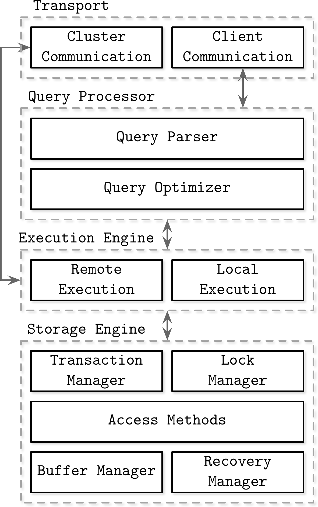

# DBMS 아키텍쳐 개요

RDB는 여러 종류가 있지만 `관계 모델` 이라는 수학적인 모델을 바탕으로 함. 그래서 기본적인 구조는 모두 동일하므로 공통적인 구조를 이해하는 것이 좋음.

## 쿼리 평가 엔진

쿼리 평가 엔진 (Query Processor)는 SQL 구문을 분석하고 어떤 순서로 데이터에 접근할지 결정한다. 그래서 쿼리 평가 엔진이 DBMS의 핵심 기능과 연관이 깊으며 성능과도 연관이 깊다.

이때 결정된 계획에 기반을 둬서 데이터에 접근하는 것을 Access Methods라고 부른다.

## 버퍼 매니저

버퍼를 관리한다.

## 디스크 용량 매니저

디스크에 데이터를 영구적으로 저장할 때, 어디에 어떻게 저장할지 결정한다.

## 트랜잭션 매니저, 락 매니저

보통 여러 사람이 DB에 접근하기 때문에 무결성이 깨지지 않게 트랜잭션의 정합성을 유지하고 필요한 경우 데이터에 락을 건다.

## 리커버리 매니저

데이터를 백업하고 복구하는 역할을 담당한다.

# DBMS와 버퍼

디스크보다는 메모리 접근속도가 빠르기 때문에 메모리 공간인 버퍼를 사용한다.

## 공짜 밥

영속적으로 데이터를 저장할 수 있는 공간인 디스크는 용량이 크지만 속도가 느리고 메모리 (버퍼)는 용량이 작지만 속도가 빠르다. 디스크와 버퍼 사이를 잘 트레이드 오프 해야 한다.

## DBMS와 기억장치

DBMS는 보통 2차 기억장치 (하드디스크, SSD)와 1차 기억장치 (메모리) 를 사용한다.

DBMS는 자주 사용되는 데이터를 1차 기억장치에 올려 성능 향상을 꾀한다.

## 메모리 위 두개의 버퍼

보통 DBMS는 두 종류의 버퍼를 사용한다. 단 DBMS마다 버퍼 명은 조금 다르지만 하는 역할은 동일하다.

- 데이터 캐시 : 디스크 데이터 일부분을 메모리에 캐시함. 특히 조회 구문에서 데이터를 요청할 때 유용함.
- 로그 버퍼 : 갱신처리를 수행하는 쿼리문과 연관이 있으며 그런 쿼리문을 받을 때 로그 버퍼에 변경 정보를 저장한다. 이후에 디스크에 저장된 데이터에 대해 갱신한다. 따라서 갱신처리는 비동기적으로 동작된다. (속도 때문데)

## 메모리의 성질이 초래하는 트레이드오프

메모리의 휘발성 때문에 커밋이란 기능이 있다. 위에서 설명한 로그 버퍼에 쌓인 변경 정보를 메모리의 휘발성 때문에 잃게 될 수도 있는데 `Commit` 이란 기능으로 갱신 처리를 확정한다.

## 시스템 특성에 따른 트레이드오프

일반적으로 DBMS에서 갱신처리보다 조회가 많고 데이터도 많으므로 로그 버퍼보다 데이터 캐시 용량이 더 크다.

## 워킹 메모리 → 추가적인 메모리 영역

데이터 캐시, 로그 버퍼 외에도 워킹 메모리라는 메모리 영역을 사용할 수 있다. 이 공간은 정렬이나 해시 등 DB 작업용 영역으로 이 영역의 이름, 관리 방법은 DBMS마다 다 다르다.

그리고 이 공간은 공간이 부족하게 되면 디스크를 사용하게 될 수도 있다.

# DBMS와 실행 계획

일반적으로 프로그래머가 쿼리문을 짜서 데이터에 접근할 때 데이터의 위치나 접근 절차 등을 고려하지 않는다. 그래서 비절차적인 부분이 있다.

## 권한 이양의 죄악

비절차적인 부분은 데이터에 어떻게 접근할 것인지를 정하는 것이 아니라 어떤 데이터에 접근할지에 대해 집중하게 해준다.

하지만 어떤 데이터에 접근할지에 대해서만 집중하면 성능 이슈가 있을 수 있기 때문에 DBMS가 정하는 절차를 알 필요가 있다.

## 데이터에 접근하는 방법 결정

데이터 접근 절차는 DBMS의 쿼리 평가 엔진 (Query Processor)에서 처리하며 순서는 다음과 같다.

1. Query Parser
    
    SQL 문법 검사, 실제로 존재하는 테이블에 접근하고자 하는지 검사 등
    
2. Query Optimizer
    
    인덱스 유무 등 여러 조건을 고려해 많은 실행 계획을 작성하여 그 중 가장 비용이 적은 계획을 선택한다. 이때 `카탈로그 매니저` 라는 공간에 접근하여 최적화에 필요한 정보에 접근한다.
    

## 옵티마이저, 통계 정보

카탈로그 매니저에 저장되는 데이터베이스의 통계 정보에 따라 최적화에 많은 영향을 받으므로 이에 대해 신경써야 한다.

- 각 테이블의 레코드 수
- 각 테이블의 필드 수, 필드 크기
- 필드의 카디널리티
- 필드값에 어떤 값이 얼마나 분포되어 있는가
- 인덱스 정보

## 최적의 실행 계획

DBMS들은 통계 정보를 갱신하기 위한 쿼리 명령어가 있다. 보통 통계정보를 갱신하는 작업은 오래 걸리므로 적절하게 사용해야 한다.

# 실행 계획의 SQL 구문의 성능을 결정

DBMS 엔진이 생성해준 실행 계획에 따라 성능이 정해지는데 이를 더 최적화 하기 위해 사용자(프로그래머)는 실행 계획을 확인해볼수 있다.

## 실행 계획 확인 방법

- MySQL : `EXPLAIN EXTANDED [SQL 구문]`
- PostgreSQL : `EXPLAIN [SQL 구문]`

## 테이블 풀 스캔의 실행 계획

테이블을 풀스캔할때의 실행 계획을 살펴보면 다음과 같은 요소가 있다.

- 조작 대상 객체
    
    해당 실행 구문이 어느 테이블이나 객체를 조작하는지 나타낸다.
    
- 객체에 대한 조작의 종류
    
    객체에 어떤 동작을 하는지 설명한다.
    
- 조작 대상 레코드 수
    
    조작하는 레코드 수를 의미한다.
    

## 인덱스 스캔의 실행 계획

`WHERE` 문을 이용해 인덱스가 붙은 조건의 쿼리문은 인덱스 스캔이라는 조작이 나타난다. 인덱스 스캔은 이진탐색을 이용해 스캔하기 때문에 일반적으로 데이터를 조회하는 속도가 빨라진다.

## 간단한 테이블 결합의 실행 계획

두개 이상의 테이블을 엮어 데이터를 조회할 때엔 실행 계획이 복잡해진다. 보통 DBMS는 결합을 할 때 세가지 종류의 알고리즘을 사용한다.

- Nested Loops : 한쪽 테이블을 읽으며 레코드 하나마다 결합 조건에 맞는 레코드를 다른 테이블에서 찾음
- Sort Merge : 결합 키로 레코드를 정렬한후에 순차적으로 두 테이블을 결합함 (이때 워킹 메모리 사용)
- Hash : 결합 키값을 해시값으로 맵핑함.

# 실행 계획의 중요성

쿼리 옵티마이저는 훌륭하지만 통계정보가 옳지 못하거나 설정을 잘못했거나 인덱스를 사용하지 않거나 쿼리문을 이상하게 짜면 느려질 수 있다.

그런 경우 옵티마이저에게 실행 계획에 대한 힌트를 제시할 수도 있지만 DBMS의 부족함을 나타내는 꼴이 된다.

# 요약

- DBMS는 속도 향상을 위해 메모리에 `데이터 캐시`와 `로그 버퍼`라는 캐시 영역을 가짐.
- DBMS는 내부적으로 쿼리를 파싱하고 쿼리를 통해 동작할 계획을 세우는 옵티마이저가 있음.
    - 옵티마이저는 여러 정보 (특히 DB의 통계정보)와 사용자가 입력한 쿼리문을 통해 최적화를 수행함.
    - 사용자가 옵티마이저에게 실행 계획에 대한 힌트를 주거나 (비권장)
    - 인덱스 사용, 통계정보를 올바르게 설정하는 방법 등이 있음.